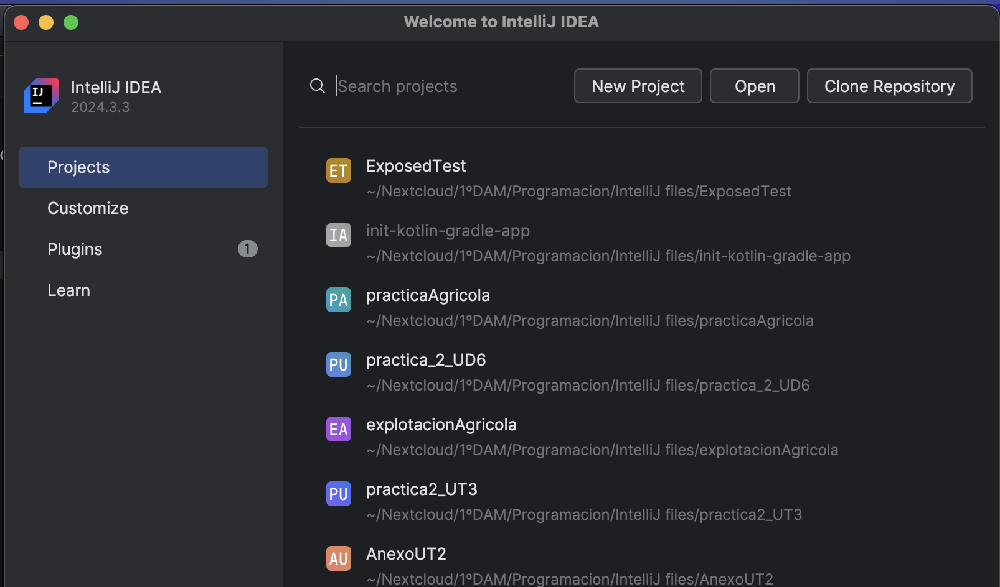
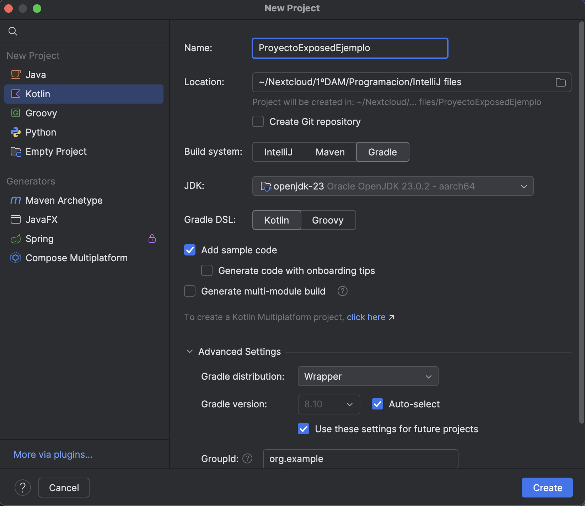
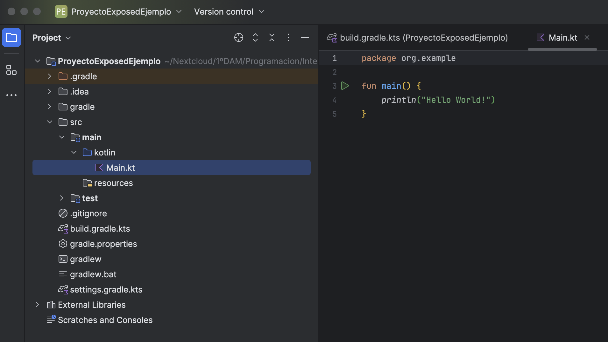
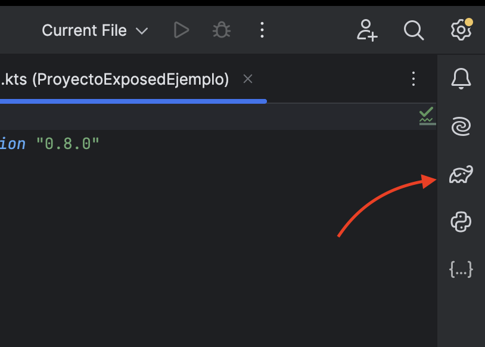
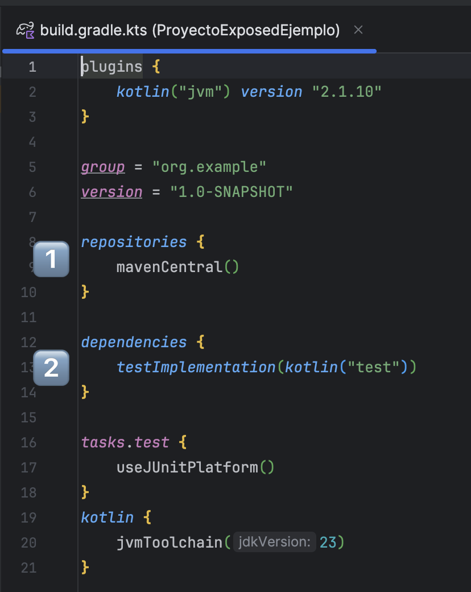
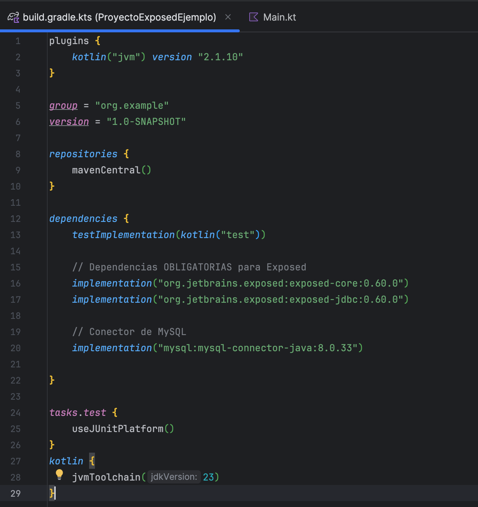
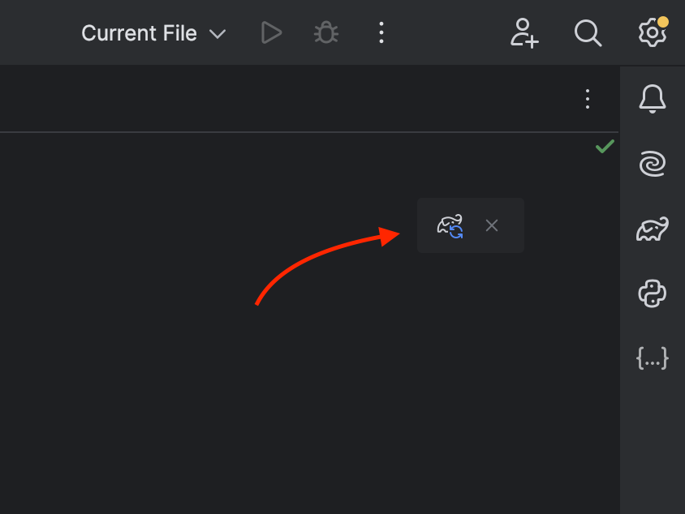
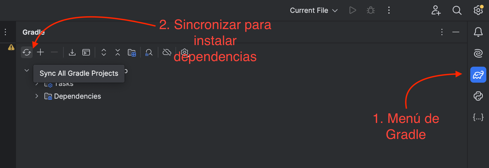
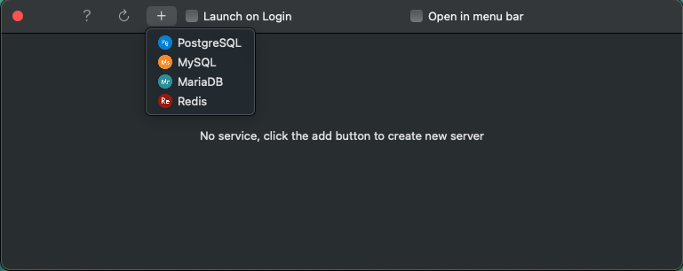
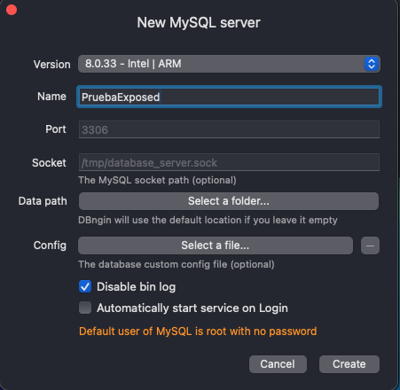

# Tutorial de instalación Kotlin Exposed

## Preparación del proyecto

Lo primero que debemos hacer es crear un proyecto con el compilador Gradle.

Al abrir Intellij tenemos esta ventana habitualmente:



Debemos seleccionar Nuevo Proyecto o New Project para configurar un projecto desde cero.


Nos saldrá la ventana habitual de creación de proyecto y debemos dejar las opciones como en la siguiente foto:



Al elegir que tenga archivos de ejemplo se nos crearán varios archivos que no habiamos visto hasta la fecha y nos facilitará el trabajo.

Al pulsar en crear tardará unos minutos en descargar todo lo necesario pero es importante que verifiquemos que finalmente contamos con una estructura de archivos similar a esta:




> ⚠️ !OJO¡
> Verifica sobretodo que cuentes con:
> - build.gradle.kts
> - settings.gradle.kts
> - El icono de gradle a la izquierda (creo que es un elefante)

Detalle del icono de Gradle ⬇️




## Instalación de dependencias de Gradle (Instalando Exposed y conectores)

Conozcamos un poco el archivo build.gradle.kts




- 1️⃣ Apuntan a los repositorios (almacenes online de dependencias) de donde Glradle descargará las dependencias que añadamos.

- 2️⃣ Apuntan a las dependencias propiamente, le dan a Gradle la información de que dependencia instalar y de que paquete (que esté en un repositorio) debe instalarla. Además dará tambien la información de la versión.

De momento no hay ninguna instalada, para este tutorial instalaremos Exposed y ademas el conector de mysql pero dejaré las dependencias de los demás conectores para el resto de SGBDs.

Dentro de `dependencies` añadiremos debajo de las lineas que ya haya las siguientes dos:

```Kotlin
implementation("org.jetbrains.exposed:exposed-core:0.60.0")
implementation("org.jetbrains.exposed:exposed-jdbc:0.60.0")
```

Las lineas anteriores deben estar presentes siempre y como para el ejemplo usaremos MySQL añadiremos una más:

```Kotlin
implementation("mysql:mysql-connector-java:8.0.33")
```

Nuestro archivo build.gradle.kts debe haber quedado tal que así:



Y si lo hemos hecho todo bien Gradle se dará cuenta que hemos declarado nuevas dependencias y nos dejará instalarlas. Esto podemos hacerlo de dos maneras.

Pulsando en el siguiente botón que aparecerá arriba a la derecha:


O entrando en el menú de Gradle y haciendolo manualmente:



🎉De esta forma deberiamos tener acceso ya a la API de Exposed y al conector de MySQL🎉


# Empezar a usar Exposed con MySQL

## Crear el servidor y crear la base de datos (yo lo mostraré usando DBngin)

Partimos de la base de que tenemos DBngin instalado, le daremos al icono "+" para elegir MySQL como SGBD, tal y como se ve en la imagen:



Se nos abrirá la configuración, SOLO CAMBIAMOS EL CAMPO "name" QUE SERÁ EL NOMBRE DEL SERVIDOR EN DBngin.
Debemos recordar para después que el usuario será "root" y la contraseña será un string vacío "".
Le daremos a create.



Tendremos ahora el servidor creado y podremos pulsar en "Start" para que empiece a funcionar.


## Dependencias para el resto de SGBDs, su conexión y configuración

### MariaDB

✚Añadir dependencia:

```Kotlin
implementation("org.mariadb.jdbc:mariadb-java-client:3.3.1")
````

⚙️Conexión y configuración:

```Kotlin
Database.connect("jdbc:mariadb://localhost:3306/test",
    driver = "org.mariadb.jdbc.Driver",
    user = "root",
    password = "your_pwd"
)
```

### MySQL

✚Añadir dependencia:

```Kotlin
implementation("mysql:mysql-connector-java:8.0.33")
```

⚙️Conexión y configuración:

```Kotlin
Database.connect(
    "jdbc:mysql://localhost:3306/test",
    driver = "com.mysql.cj.jdbc.Driver",
    user = "user",
    password = "password"
)
```

### Oracle

✚Añadir dependencia:
```Kotlin
implementation("com.oracle.database.jdbc:ojdbc8:12.2.0.1")
````

⚙️Conexión y configuración:

```Kotlin
Database.connect(
    "jdbc:oracle:thin:@//localhost:1521/test",
    driver = "oracle.jdbc.OracleDriver",
    user = "user",
    password = "password"
)
```

### PostgreSQL

✚Añadir dependencia:

```Kotlin
implementation("org.postgresql:postgresql:42.7.1")
```

⚙️Conexión y configuración:

```Kotlin
Database.connect(
    "jdbc:postgresql://localhost:12346/test",
    driver = "org.postgresql.Driver",
    user = "user",
    password = "password"
)
```

### SQL Server

✚Añadir dependencia:

```Kotlin
implementation("com.microsoft.sqlserver:mssql-jdbc:9.4.1.jre8")
````

⚙️Conexión y configuración:

```Kotlin
Database.connect(
    "jdbc:sqlserver://localhost:32768;databaseName=test",
    "com.microsoft.sqlserver.jdbc.SQLServerDriver",
    user = "user",
    password = "password"
)
```

### SQLite

✚Añadir dependencia:

```Kotlin
implementation("org.xerial:sqlite-jdbc:3.44.1.0")
```

⚙️Conexión y configuración:

```Kotlin
Database.connect("jdbc:sqlite:/data/data.db", "org.sqlite.JDBC")
```

Or in-memory database:

```Kotlin
Database.connect("jdbc:sqlite:file:test?mode=memory&cache=shared", "org.sqlite.JDBC")
````

Set SQLite compatible isolation level:

```Kotlin
TransactionManager.manager.defaultIsolationLevel = Connection.TRANSACTION_SERIALIZABLE
// or Connection.TRANSACTION_READ_UNCOMMITTED
```


## Bibliografía

- [Tutorial de youtube de Clean Code Cast (en inglés)](https://youtu.be/Ph9RYiQGodY?si=hsq6xPdZ6YjbVCCI). Aunque el ya parte de un proyecto al que le quiere implementar Exposed por lo que solo he cogido pinceladas.
- [Documentación oficial de Exposed](https://www.jetbrains.com/help/exposed/getting-started-with-exposed.html). Para las dependencias de cada SGBD y la configuración de conexión aparte de para la API.
- [Repositorio oficial de Exposed](https://github.com/JetBrains/Exposed). Para la instalación de dependencias para Gradle Kotlin DSL.
- [Video de presentación del canal oficial de Kotlin](https://youtu.be/YOXWnM_8vz8?si=NBfoIpjrf-8wspzi)